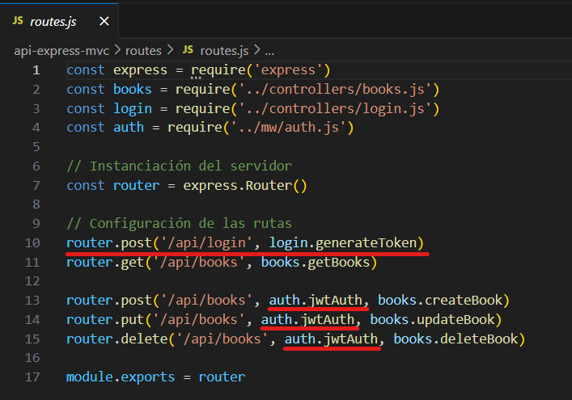
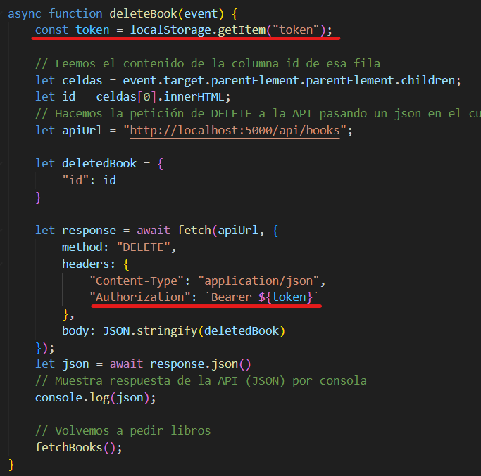

# PF-M08UF2

## Cambios para la autenticación JWT:
### Backend:
- **controller/login.js:** Se encarga de verificar que el usuario/contraseña sean correctos, y genera un token.
- **mw/auth.js:** Comprueba que el usuario tenga un token valido para realizar una operación.
- **.env:** Contiene la clave secreta.

- **routes.js**:
  

Cuando se realize una llamada POST a /api/login, entrara a la funcion **generateToken**, que tratara de verificar el usuario.
Si se hace una llamada de tipo POST, DELETE o PUT a /api/books, entrara a la funcion **jwtAuth**, que tratara de verificar el token.

### Frontend:
- **login.html:** Pagina donde el usuario introduce sus credenciales.
- **login.js:** Hace la llamada al Backend para tratar de generar el tokenen base a las credenciales del usuario.

