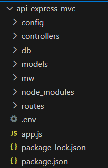
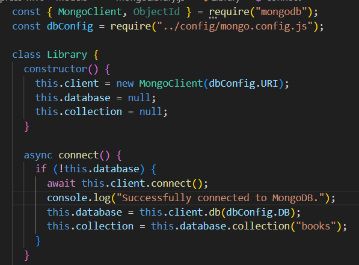
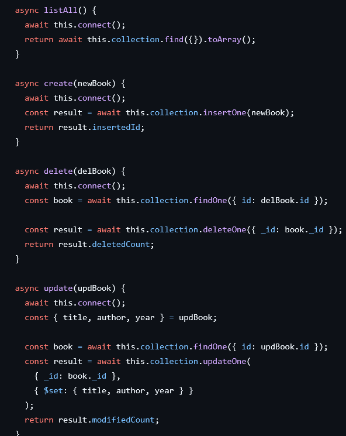

# PF-M08UF2

## Arquitectura:

- **config:** Contiene los datos de configuración del mongo/sql.
- **controllers:** Se encarga de manejar las peticiones que el usuario realiza.
- **models:** Se encarga de interactuar con la base de datos.
- **mw:** Verifica las peticiones antes de llegar a los controladores.
- **routes:** Define las rutas a los controladores.

## Cambio de SQL a MONGO:

A diferencia importante es el hecho de que SQL trabaja de manera **sincrona**, mientras que Mongo es **asincrono**.

Como el constructor no puede ser asincrono, no realizamos la conexion dentro de este como en el modulo SQL, sino que
creamos una funcion asincrona que monte la conexion, para luego llamarla cuando se tenga que realizar alguna operación.

El sistema de llamadas es similar a SQL, solo cambia el nombre de las funciones para realizar acciones y que tienen un
identificador unico propio (_id).

## Cambios para la Autenticación JWT:
### Backend:
- **controller/login.js:** Se encarga de verificar que el usuario/contraseña sean correctos, y genera un token.
- **mw/auth.js:** Comprueba que el token dentro del **header Authorization** sea valido para realizar una operación.
- **.env:** Contiene la clave secreta.
- **routes.js**:
  

Cuando se realize una llamada POST a /api/login, entrara a la funcion **generateToken**, que tratara de verificar el usuario.

Si se hace una llamada de tipo POST, DELETE o PUT a /api/books, entrara a la funcion **jwtAuth**, que tratara de verificar el token.

### Frontend:
- **login.html:** Pagina donde el usuario introduce sus credenciales.
- **login.js:** Hace la llamada al Backend para tratar de generar el tokenen base a las credenciales del usuario.
- **script.js:**

Ahora para realizar acciones como borrar, editar o crear libros, se introduce el token dentro de **Authorization** y lo pasa a los **headers**.
Si todo va bien realiza la operacion y se va a ver reflejado en el index.html.

